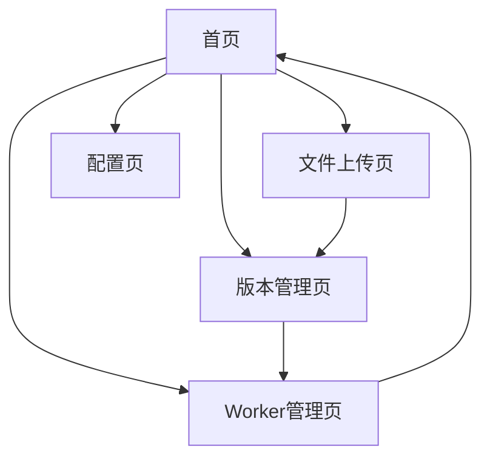

# 版本管理系统需求文档

## 1. Product Overview

本项目是一个版本管理系统，用于自动化管理Cloudflare Worker代码更新和腾讯云COS文件上传。

* 主要解决手动修改Worker代码版本信息的繁琐问题，提供可视化界面进行版本管理。

* 目标用户是需要频繁发布软件更新的开发者和运维人员。

* 通过集成Cloudflare API和腾讯云COS API，实现一站式版本发布流程。

## 2. Core Features

### 2.1 User Roles

| Role | Registration Method | Core Permissions         |
| ---- | ------------------- | ------------------------ |
| 管理员  | 默认用户访问              | 可以修改Worker代码、上传文件、管理版本信息 |

### 2.2 Feature Module

我们的版本管理系统包含以下主要页面：

1. **首页**: 版本概览、快速操作入口、最新版本状态展示
2. **版本管理页**: 版本信息编辑、更新日志管理、强制更新设置
3. **文件上传页**: 文件上传到腾讯云COS、下载链接生成
4. **Worker管理页**: Cloudflare Worker代码查看和更新
5. **配置页**: API密钥配置、存储桶设置

### 2.3 Page Details

| Page Name | Module Name | Feature description                     |
| --------- | ----------- | --------------------------------------- |
| 首页        | 版本概览        | 显示当前版本号、下载次数、最后更新时间等关键信息                |
| 首页        | 快速操作        | 提供一键发布新版本、查看更新日志等快捷按钮                   |
| 首页        | 状态监控        | 显示Worker运行状态、COS存储使用情况                  |
| 版本管理页     | 版本信息编辑      | 修改版本号、编辑更新日志、设置强制更新标志                   |
| 版本管理页     | 历史版本        | 查看历史版本记录、回滚到指定版本                        |
| 文件上传页     | 文件上传        | 拖拽上传文件到腾讯云COS、显示上传进度                    |
| 文件上传页     | 链接管理        | 自动生成下载链接、复制链接到剪贴板                       |
| Worker管理页 | 代码查看        | 显示当前Worker代码、高亮版本信息部分                   |
| Worker管理页 | 代码更新        | 通过Cloudflare API更新Worker代码中的versionInfo |
| 配置页       | API配置       | 设置Cloudflare API Token、腾讯云密钥            |
| 配置页       | 存储配置        | 配置COS存储桶名称、地域等参数                        |

## 3. Core Process

主要用户操作流程如下：

**版本发布流程**：

1. 用户在文件上传页上传新版本文件到腾讯云COS
2. 系统自动生成下载链接
3. 用户在版本管理页编辑版本信息（版本号、更新日志等）
4. 系统通过Cloudflare API更新Worker代码中的versionInfo
5. 发布完成，用户可在首页查看更新状态

**配置管理流程**：

1. 用户首次使用时在配置页设置API密钥
2. 配置腾讯云COS存储桶信息
3. 测试连接确保配置正确

## 4. User Interface Design

### 4.1 Design Style

* 主色调：蓝色系（#2563eb）和灰色系（#64748b）

* 次要颜色：绿色（#10b981）表示成功，红色（#ef4444）表示错误

* 按钮样式：圆角按钮，悬停效果

* 字体：系统默认字体，标题16px，正文14px

* 布局风格：卡片式布局，顶部导航栏

* 图标风格：简洁的线性图标，支持上传、下载、设置等常用操作

### 4.2 Page Design Overview

| Page Name | Module Name | UI Elements                  |
| --------- | ----------- | ---------------------------- |
| 首页        | 版本概览        | 大号数字显示版本号，卡片式布局展示关键指标，使用蓝色主题 |
| 首页        | 快速操作        | 醒目的操作按钮，使用渐变背景，hover效果       |
| 版本管理页     | 版本信息编辑      | 表单式布局，输入框和文本域，实时保存提示         |
| 文件上传页     | 文件上传        | 拖拽区域使用虚线边框，上传进度条，文件列表展示      |
| Worker管理页 | 代码查看        | 代码编辑器样式，语法高亮，只读模式            |
| 配置页       | API配置       | 安全的密码输入框，连接测试按钮，状态指示器        |

### 4.3 Responsiveness

只需要做桌面端适配即可
